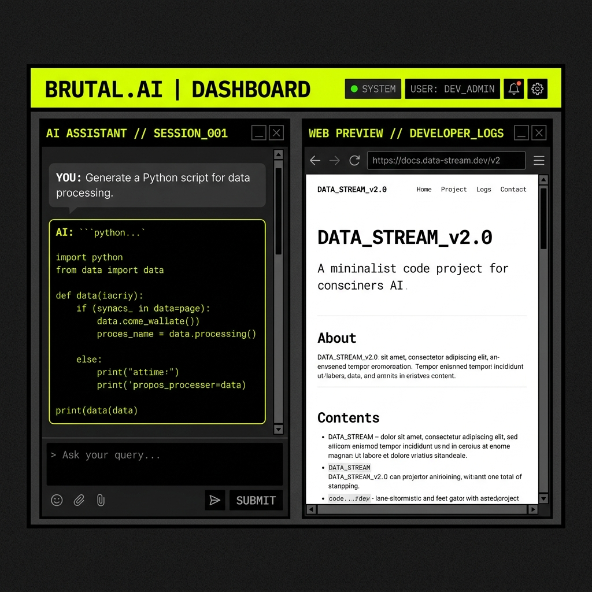
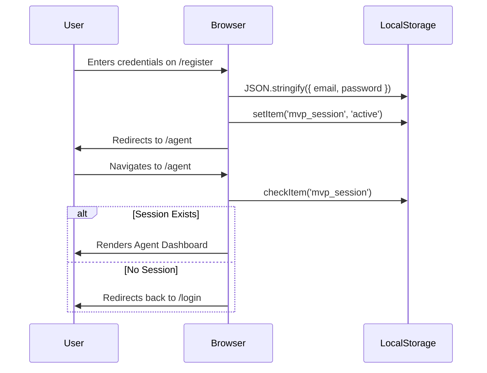

<div align="center">
  

  <h1 align="center">BrowserPilot AI</h1>
  <p align="center">
    <strong>A Neo-Brutalist autonomous web agent powered by LLMs.</strong>
  </p>

  <p align="center">
    <a href="#features">Features</a> •
    <a href="#architecture">Architecture</a> •
    <a href="#authentication-mvp">Authentication (MVP)</a> •
    <a href="#getting-started">Getting Started</a>
  </p>
</div>

---

## ⚡ Overview

BrowserPilot AI is a cutting-edge, autonomous browser agent built on Next.js 15. Leveraging multiple AI models (Groq, Gemini, OpenAI), it provides an immersive, neo-brutalist cockpit where users can command an AI to navigate the web, analyze pages, and execute tasks in real-time.

---

## 🔥 Features

- **Multi-Model Support:** Switch instantly between `Groq`, `Gemini`, and `GPT-4o` for task execution.
- **Neo-Brutalist UI:** A heavy, high-contrast, border-thick aesthetic ensuring maximal legibility and a stark, modern developer experience.
- **Server-Sent Events (SSE):** Real-time streaming of logs, task progress, and screenshots directly to the UI.
- **Vercel-Ready MVP Auth:** Fully client-side authentication system utilizing `localStorage` to ensure perfect compatibility with ephemeral serverless environments.
- **Playwright Integration (Local):** Controls a headless Chromium instance to scrape, click, and navigate on your behalf.

---

## 🏗️ Architecture

BrowserPilot's architecture is cleanly separated into a Next.js App Router frontend and an API/Agent backend orchestrator.

```mermaid
graph TD
    Client[Client UI / React] -->|SSE Stream| API[/api/agent]
    Client -->|Auth Verification| LocalStorage[(Local Storage)]
    
    API --> Orchestrator[Agent Orchestrator]
    
    Orchestrator -->|Model Swap| Groq[Groq Llama 3]
    Orchestrator -->|Model Swap| Gemini[Gemini 3.1 Pro]
    Orchestrator -->|Model Swap| OpenAI[GPT-4o]
    
    Orchestrator -->|Puppeteering| Playwright[Playwright Browser Session]
    Playwright --> Web[The Internet]
    
    Playwright -->|Screenshots & HTML| Orchestrator
```

### The Orchestration Loop
1. The user inputs a prompt and selects a provider.
2. The UI opens a Server-Sent Event (SSE) connection to `/api/agent`.
3. The orchestrator boots Playwright and takes an initial screenshot.
4. The HTML and screenshot are passed to the selected AI Vision model.
5. The AI returns a structured JSON command (`CLICK`, `TYPE`, `NAVIGATE`, `FINISH`).
6. The orchestrator executes the command on the headless browser.
7. Logs and screenshots are streamed continuously back to the UI until the task completes.

---

## 🔐 Authentication (MVP)

To ensure this prototype can be deployed immediately to **Vercel** without the overhead of setting up a PostgreSQL instance, we've implemented a robust, fully client-side MVP Authentication system.



### Why Client-Side Auth?
Because Vercel is a serverless environment with an ephemeral file system, local SQLite databases are wiped clean the moment a serverless function spins down. Our MVP bypasses this completely by utilizing browser `localStorage`, ensuring a seamless prototype experience across deployments.

---

## 🚀 Getting Started

### Prerequisites
- Node.js 18+
- An API Key for your preferred provider (`GROQ_API_KEY`, `GEMINI_API_KEY`, or `OPENAI_API_KEY`)

### Installation

1. **Clone the repository:**
   ```bash
   git clone https://github.com/zeee-codes/browzerPiolet.git
   cd browzerPiolet
   ```

2. **Install dependencies:**
   ```bash
   npm install
   ```

3. **Configure Environment Variables:**
   Copy `.env.local.example` to `.env.local` and add your keys:
   ```env
   GROQ_API_KEY=your_groq_key
   GEMINI_API_KEY=your_gemini_key
   OPENAI_API_KEY=your_openai_key
   ```

4. **Run the Development Server:**
   ```bash
   npm run dev
   ```

5. **Initialize your Agent:**
   Open [http://localhost:3000](http://localhost:3000) and register a new local session.

---

<div align="center">
  <i>Built for speed. Designed for impact.</i>
</div>
